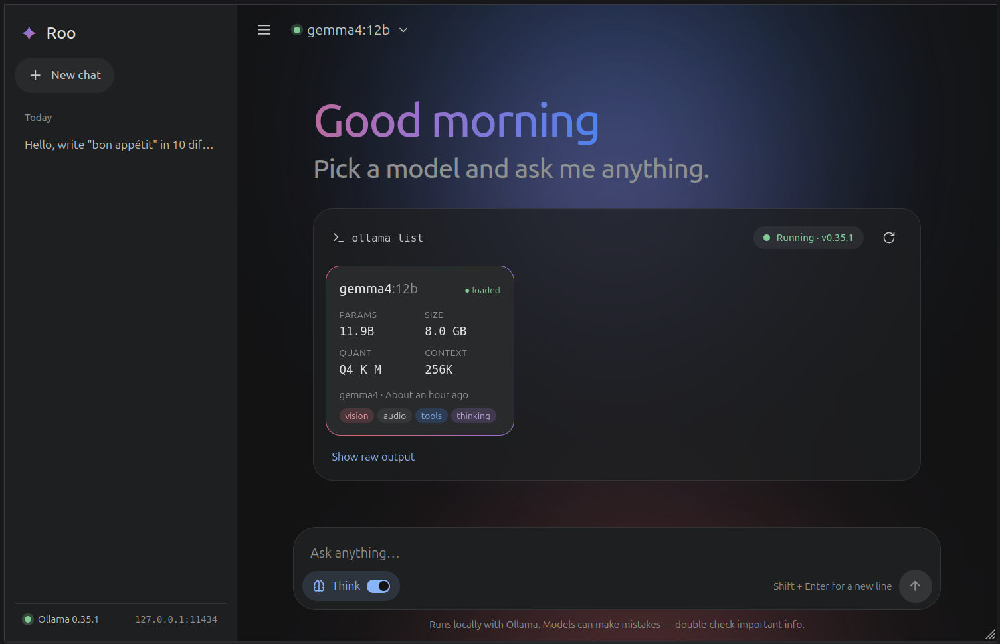

# Roo ✦

A Gemini-style chat app for local [Ollama](https://ollama.com) models.
Frontend: Vite + React 19. Backend: Node.js + TypeScript (Express 5).



## Quick start

```bash
ollama serve           # if Ollama isn't already running
npm install
npm run dev            # API on :3001, UI on http://localhost:6400
```

- `npm run dev:lan`: also exposes the UI on your local network over **HTTPS**, so you can open it from your phone (`https://<your-ip>:6400`). The certificate is self-signed and generated locally (no internet needed): accept the browser warning once. HTTPS is required for the microphone on anything other than `localhost`.
- `npm run build && npm start`: production build; the API serves the UI on http://localhost:3001.

## Features

- **Ollama status on launch.** Runs `ollama list`, then adds details from `/api/tags`, `/api/show` and `/api/ps`: parameters, quantization, context length, capabilities (thinking / vision / tools) and whether the model is loaded. If Ollama is down, it says so and checks again every few seconds.
- **Conversations as Markdown files** in `data/conversations/`, one `.md` per chat. They're loaded at launch and saved as soon as the first message is sent. You can rename or delete them from the sidebar.
- **Resumable streaming.** Generation runs on the server, independent of the browser. If you switch to another conversation and come back, the client re-subscribes over SSE: the server first sends a snapshot of the text produced so far, then the live deltas. A reload or dropped connection resumes the same way.
- **Think toggle.** It's disabled for models without the `thinking` capability. The reasoning appears in a collapsible box between the prompt and the answer. It opens while the model thinks and folds away once the answer starts.
- **Auto-scroll.** It follows the stream only while you're at the bottom. Scroll up and it stays where you are; a ↓ button brings you back down.
- **Images and audio** for models that support them (e.g. Gemma 4 with `vision` / `audio`):
  - paste (Ctrl+V) or drag and drop images and audio files, or use **+** (on phones: Camera, Photos, Files);
  - record from the microphone with 🎤 (live waveform, discard / keep, or send right away; 5 min max);
  - attachments are processed in the browser: images are re-encoded to JPEG/PNG with phone-photo rotation applied and scaled to ≤ 2048 px; audio of any format the browser can decode (WebM/Opus, M4A, MP3, OGG…) is converted to 16 kHz mono WAV, which Ollama accepts;
  - files are stored once (content-addressed) in `data/conversations/attachments/` and linked from the conversation's Markdown. Unused files are cleaned up after a conversation is deleted.
- **Stop button**, tokens/s stats, copy buttons, and dark/light themes from the OS setting. Works on desktop and phone.

### Markdown (no libraries, no API calls)

The renderer is in `client/src/markdown/`:

- Headings h1–h6 (ATX and setext), **bold**, _italic_, ~~strike~~, `inline code`, links, autolinks, images
- Ordered, bullet and task lists with nesting (lenient about the indentation models actually produce)
- Block quotes, GitHub alerts (`> [!TIP]`), horizontal rules, tables with column alignment
- Fenced code blocks with a copy button and **syntax highlighting** for about 30 languages (JS/TS, Python, C/C++, C#, Java, Go, Rust, PHP, Ruby, Swift, Kotlin, Lua, SQL, Bash, PowerShell, JSON, YAML, TOML/INI, HTML/XML, CSS/SCSS, Diff, Dockerfile, R…)
- **LaTeX** (`$…$`, `$$…$$`, `\(…\)`, `\[…\]`, fenced ` ```math `), converted to native MathML: fractions, roots, sums and integrals, accents, `\mathbb`/`\mathcal`/…, matrices, `cases`, `aligned`, etc. Prices like "$5 and $10" are left as text.
- A small whitelist of inline HTML (`<br>`, `<sub>`, `<sup>`, `<kbd>`, `<mark>`, …), entities and footnote markers. Everything else is escaped. `javascript:` and similar URLs are blocked.

While streaming, only the block being written re-renders, and unfinished constructs (an open code fence, half a table) degrade gracefully.

## Configuration

| Variable            | Default                  | Purpose                          |
| ------------------- | ------------------------ | -------------------------------- |
| `OLLAMA_HOST`       | `http://127.0.0.1:11434` | Ollama server                    |
| `PORT`              | `3001`                   | API port                         |
| `HOST`              | `127.0.0.1`              | API bind address                 |
| `CONVERSATIONS_DIR` | `./data/conversations`   | Where the `.md` files are stored |

## Layout

```
server/src/
  index.ts        REST + SSE routes, static hosting of the built client
  ollama.ts       `ollama list` + API enrichment, streaming /api/chat
  generation.ts   server-side generations with snapshot + live fan-out
  store.ts        Markdown (de)serialization of conversations
  attachments.ts  content-addressed image/audio storage
client/src/
  markdown/       parser.ts, highlight.ts, latex.ts, Markdown.tsx
  hooks/          useConversation (SSE subscribe/resume), useStickToBottom, useRecorder
  lib/media.ts    image/audio normalization (canvas, Web Audio → WAV)
  components/     Sidebar, Welcome (status + models), Composer, Attachments, ThinkingBox, …
```
